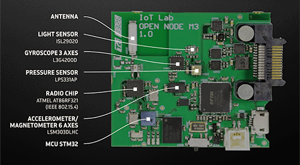
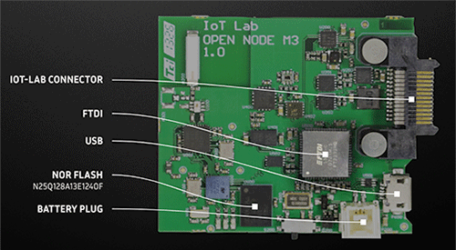

.. _iotlab_m3_board:

IOTLAB M3
#########

Overview
********

The IoT-LAB M3 board features an ARM Cortex-M3 based STM32F103REY MCU with a wide range of connectivity support and configurations. It has been designed specially for the `Iot-LAB testbed`_.

   
IoT-LAB M3 schematics can be found here: `IOTLAB M3 schematics`_

Hardware
********

- STM32F103REY
- ARM |reg| 32-bit Cortex |reg| -M3 CPU
- 72 MHz max CPU frequency
- 256 KB Flash
- 64 KB SRAM

More information about STM32F103RE can be found here:

- `STM32F103 reference manual`_
- `STM32F103 data sheet`_

Supported Features
==================

The Zephyr iotlab_m3 board configuration supports the following hardware features:

+-----------+------------+-------------------------------------+
| Interface | Controller | Driver/Component                    |
+===========+============+=====================================+
| NVIC      | on-chip    | nested vector interrupt controller  |
+-----------+------------+-------------------------------------+
| UART      | on-chip    | serial port-polling;                |
|           |            | serial port-interrupt               |
+-----------+------------+-------------------------------------+
| PINMUX    | on-chip    | pinmux                              |
+-----------+------------+-------------------------------------+
| GPIO      | on-chip    | gpio                                |
+-----------+------------+-------------------------------------+
| CLOCK     | on-chip    | reset and clock control             |
+-----------+------------+-------------------------------------+
| FLASH     | on-chip    | flash memory                        |
+-----------+------------+-------------------------------------+
| WATCHDOG  | on-chip    | independent watchdog                |
+-----------+------------+-------------------------------------+
| ADC       | on-chip    | ADC Controller                      |
+-----------+------------+-------------------------------------+
| PWM       | on-chip    | pwm                                 |
+-----------+------------+-------------------------------------+
| SPI       | on-chip    | spi                                 |
+-----------+------------+-------------------------------------+
| USB       | on-chip    | USB device                          |
+-----------+------------+-------------------------------------+
| DMA       | on-chip    | Direct Memory Access                |
+-----------+------------+-------------------------------------+

Other hardware features are not yet supported in this Zephyr port.

The default configuration can be found in the defconfig file:
``boards/arm/iotlab_m3/iotlab_m3_defconfig``

Connections and IOs
===================

Default Zephyr Peripheral Mapping:
----------------------------------

- UART_1 TX/RX: PA9/PA10
- SPI1 SCK/MISO/MOSI: PA5/PA6/PA7
- SPI2 SCK/MISO/MOSI: PB13/PB14/PB15
- I2C1 SDA/SCL: PB7/PB6

System Clock
------------

The on-board 8MHz crystal is used to produce a 72MHz system clock with PLL.

Programming and Debugging
*************************

Applications for the ``iotlab_m3`` board configuration can be built and
flashed in the usual way (see :ref:`build_an_application` and
:ref:`application_run` for more details).

Flashing
========

Flashing an application to iotlab_m3 mini
-----------------------------------------

Here is an example for the :ref:`blinky-sample` application.

.. zephyr-app-commands::
   :zephyr-app: samples/basic/blinky
   :board: iotlab_m3
   :goals: build flash

You will see the LED blinking every second.

Debugging
=========

You can debug an application in the usual way.  Here is an example for the
:ref:`blinky-sample` application.

.. zephyr-app-commands::
   :zephyr-app: samples/basic/blinky
   :board: iotlab_m3
   :maybe-skip-config:
   :goals: debug

References
**********

.. target-notes::

.. _STM32F103 reference manual:
   http://www.st.com/resource/en/reference_manual/cd00171190.pdf

.. _STM32F103 data sheet:
   http://www.st.com/resource/en/datasheet/stm32f103re.pdf
   
.. _Iot-LAB testbed:
   http://www.iot-lab.info

.. _IOTLAB M3 schematics:   
   http://github.com/iot-lab/iot-lab/wiki/Docs/iot-lab-m3-schematics.pdf
